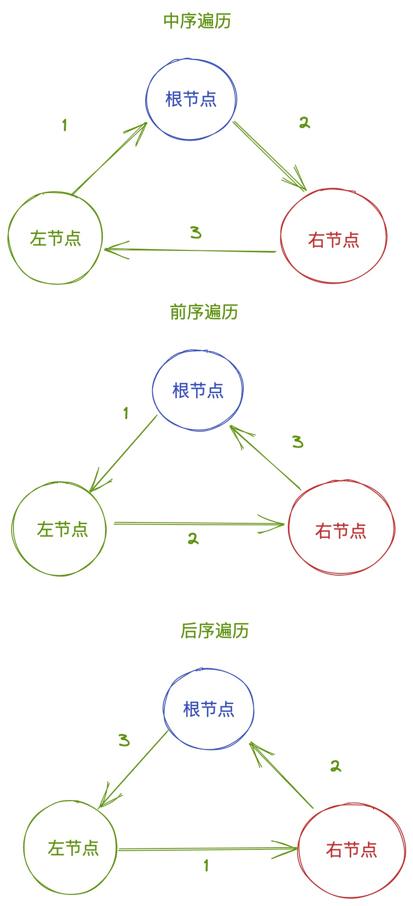

# 二叉树学习记录

## 递归方法实现前序、中序、后序排序



```JavaScript
  定义结果变量为空数组
  定义递归函数：
    if（node）为空， return；

    if（node）有值
    递归左子树： 递归函数（node.left） // 前序： 根->左->右 中序： 左->根->右 后序： 左->右->根
    递归右子树： 递归函数（node.right）
    当前node的值加入到结果变量：结果变量.push(node.val)

    执行递归函数并传入 root (root为根节点)
```

