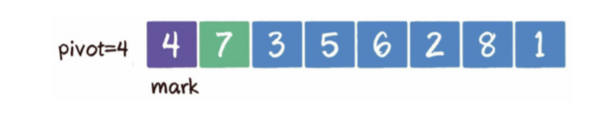
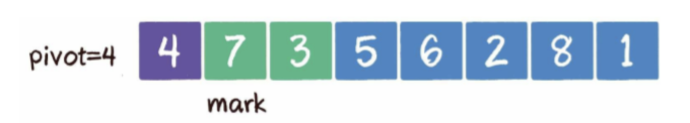
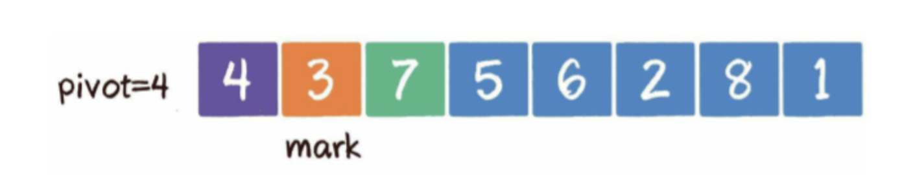
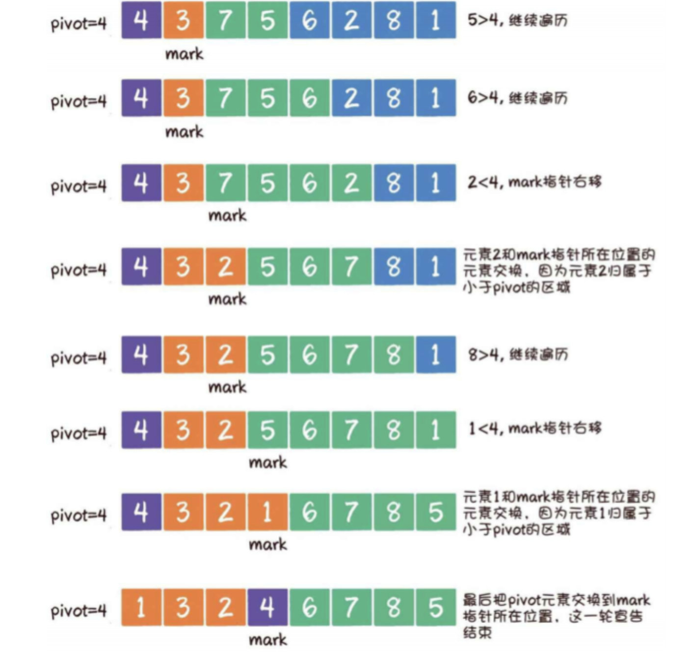

# 快速排序算法学习记录

递归实现
1. 从左侧开始 mark 是遍历的边界位置，pivot 是基准值 ，与后面的数遍历比较

2. 遍历的元素比mark大 ，继续遍历，小于mark位置的值，则mark先前进1位，遍历的元素与当前mark所在的值互换
   

3. 遍历结束，pivot值与mark值互换

4. 新一轮的比较 分别从 0 到 pivot ，pivot 到数组length-1

总结： 
1. 从 0 到数组length-1 开始 start=0 end=数组length-1
2. 0为初始mark位置，pivot等于数组[mark]
3. 遍历一边后，mark位置的值与pivot交换 使得mark左边均小于mark，右边均大于mark
4. pivot等于数组[mark]
5. 分别从start到pivot-1,pivot+1到end重新遍历，并进入递归
6. 直到遍历start>=end结束